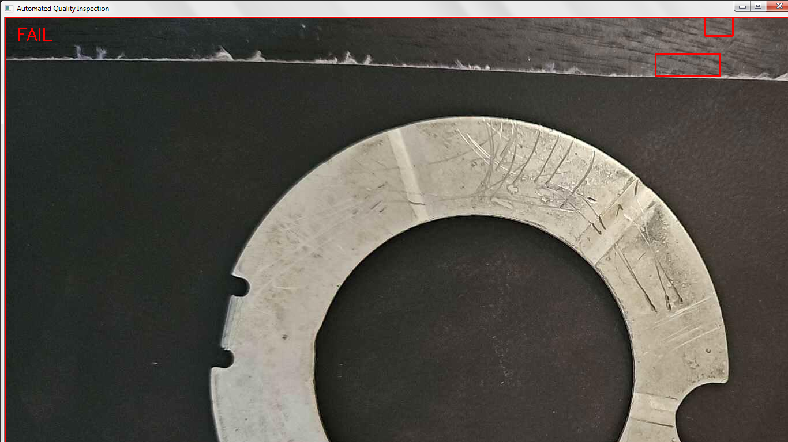

# DecodeLabs Task 2 – Automated Quality Inspection

## Project Overview

This project implements an automated quality inspection system using Python and OpenCV.

The system processes an image, applies image preprocessing techniques, detects contours and bounding boxes, and uses defect detection logic to classify an item as PASS or FAIL.

## Techniques Used

- Grayscale conversion
- Gaussian Blur
- Thresholding
- Contour detection
- Bounding boxes
- Defect detection
- PASS/FAIL classification

## Technologies

## Test Result

The quality inspection program was tested using the sample inspection image.

### Result
- Inspection Result: FAIL
- Defects Detected: 3

The program successfully processed the image using grayscale conversion, Gaussian blur, thresholding, contour detection, and bounding boxes. The detected defects were highlighted with red bounding boxes in the inspection result.

- Python
- OpenCV

## Internship

DecodeLabs – Robotics and Automation Internship
