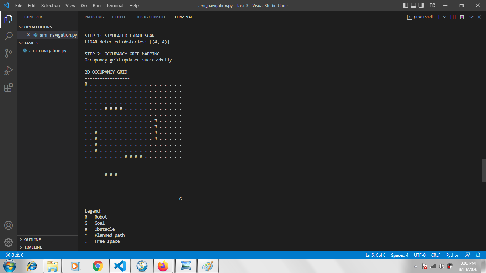
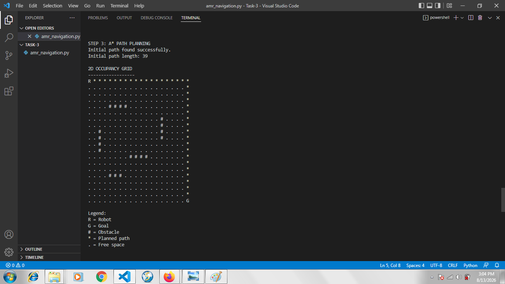
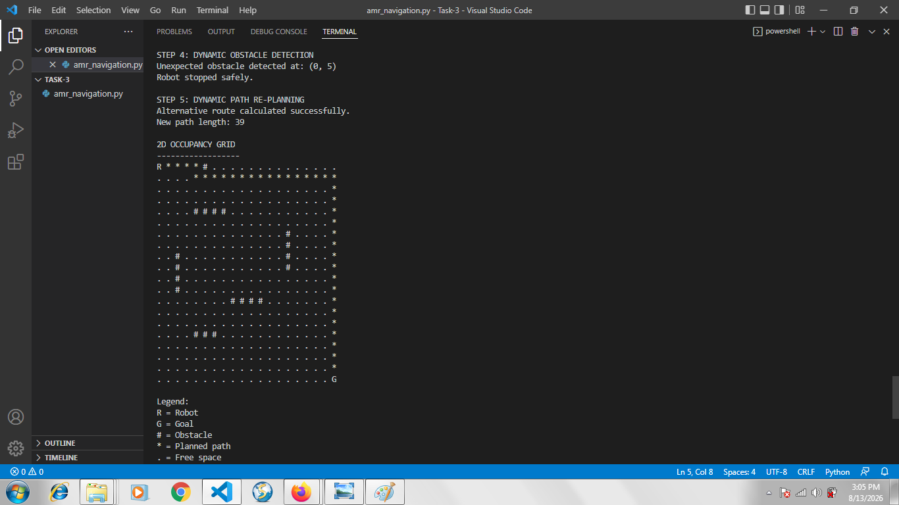
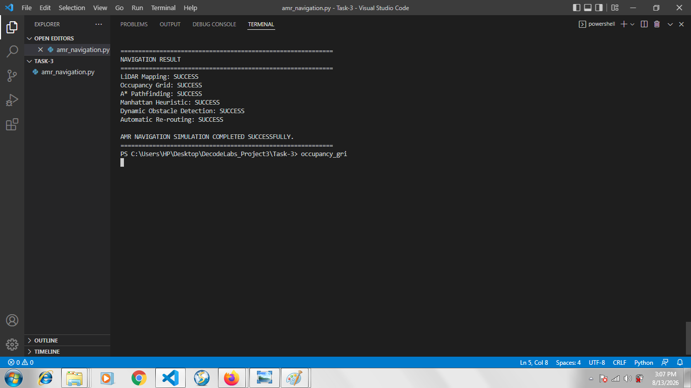

# Project 3: Autonomous Mobile Robot (AMR) Navigation

## Overview

This project implements a simulated Autonomous Mobile Robot (AMR) navigation system.

The system demonstrates:

- Simulated LiDAR sensing
- 2D occupancy grid mapping
- A* pathfinding
- Manhattan distance heuristic
- Dynamic obstacle detection
- Automatic path re-planning

## Objective

The objective is to simulate how a mobile robot can understand its environment, plan a route to a target location, detect an unexpected obstacle, and calculate an alternative route.

## Technologies

- Python
- Simulated LiDAR
- 2D Occupancy Grid
- A* Search Algorithm
- Manhattan Distance Heuristic

## How It Works

### 1. Simulated LiDAR

The program simulates LiDAR measurements around the robot and detects nearby obstacles.

### 2. Occupancy Grid

The detected obstacles and static obstacles are represented in a 2D grid.

The symbols used in the grid are:

- `R` = Robot
- `G` = Goal
- `#` = Obstacle
- `*` = Planned path
- `.` = Free space

### 3. A* Pathfinding

The A* algorithm searches the occupancy grid for a route from the robot's starting position to the goal.

The Manhattan distance is used as the heuristic.

### 4. Dynamic Obstacle Handling

An unexpected obstacle is introduced on the planned route.

The robot stops safely, and the system runs A* again to calculate an alternative route.

## Testing

The program was successfully tested using the simulated environment.

Test results:

- LiDAR Mapping: SUCCESS
- Occupancy Grid: SUCCESS
- A* Pathfinding: SUCCESS
- Manhattan Heuristic: SUCCESS
- Dynamic Obstacle Detection: SUCCESS
- Automatic Re-routing: SUCCESS

The initial path contained 39 cells, and the system successfully calculated an alternative route after the dynamic obstacle appeared.

## Evidence

### Occupancy Grid

### A* Path Planning

### Dynamic Obstacle Avoidance

### Final Result

## Internship

DecodeLabs – Robotics and Automation Internship
