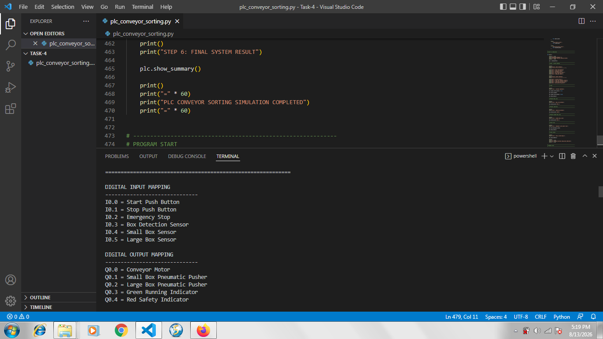
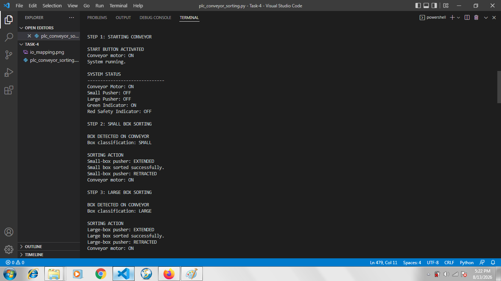
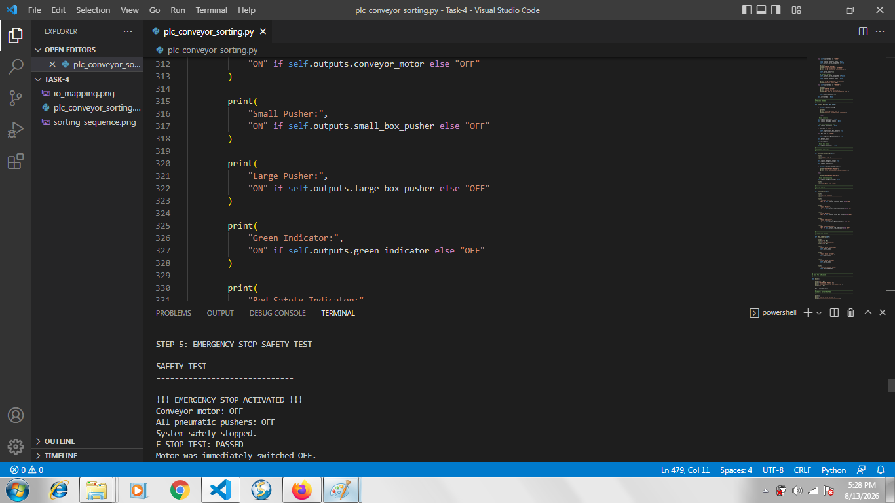
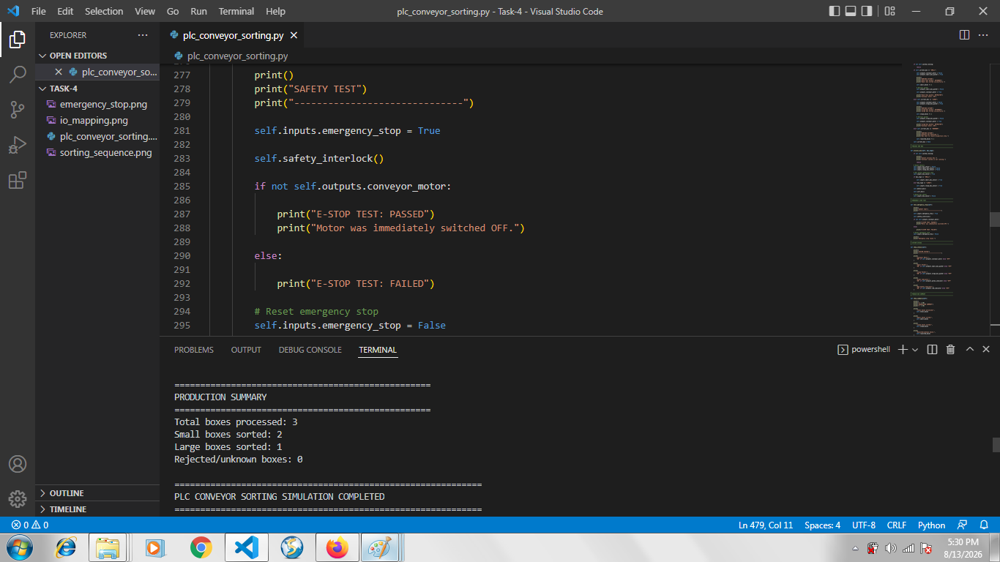

# Project 4: PLC-Based Conveyor Sorting System

## Overview

This project implements a simulated PLC-based conveyor sorting system using Python.

The system demonstrates industrial control concepts including digital input and output mapping, sequence-based control, box classification, pneumatic sorting, and an Emergency Stop safety interlock.

## Objective

The objective is to simulate an automated conveyor line that detects and sorts boxes according to their size while maintaining a strict safety system.

## Digital Inputs

| Address | Input |
|---|---|
| I0.0 | Start Push Button |
| I0.1 | Stop Push Button |
| I0.2 | Emergency Stop |
| I0.3 | Box Detection Sensor |
| I0.4 | Small Box Sensor |
| I0.5 | Large Box Sensor |

## Digital Outputs

| Address | Output |
|---|---|
| Q0.0 | Conveyor Motor |
| Q0.1 | Small Box Pneumatic Pusher |
| Q0.2 | Large Box Pneumatic Pusher |
| Q0.3 | Green Running Indicator |
| Q0.4 | Red Safety Indicator |

## Control Sequence

1. The Start button activates the conveyor motor.
2. The box detection sensor detects a box.
3. The box sensors classify the box as small or large.
4. The appropriate pneumatic pusher is activated.
5. The pusher retracts after sorting.
6. The conveyor resumes operation.
7. If the Emergency Stop is activated, the conveyor motor and pneumatic pushers are immediately switched OFF.

## Safety Interlock

The Emergency Stop has priority over normal operation.

During testing, the Emergency Stop was activated while the system was running.

Test result:

- Conveyor motor: OFF
- Small pusher: OFF
- Large pusher: OFF
- System safely stopped
- E-STOP TEST: PASSED

## Testing Results

The simulation successfully processed three boxes:

- Total boxes processed: 3
- Small boxes sorted: 2
- Large boxes sorted: 1
- Rejected/unknown boxes: 0

The complete simulation finished successfully.

## Evidence

### Digital Input and Output Mapping

### Conveyor Sorting Sequence

### Emergency Stop Safety Test

### Final Result

## Technologies

- Python
- PLC control concepts
- Digital I/O mapping
- State-machine based control
- Sensor integration
- Industrial safety interlock

## Internship

DecodeLabs – Robotics and Automation Internship
